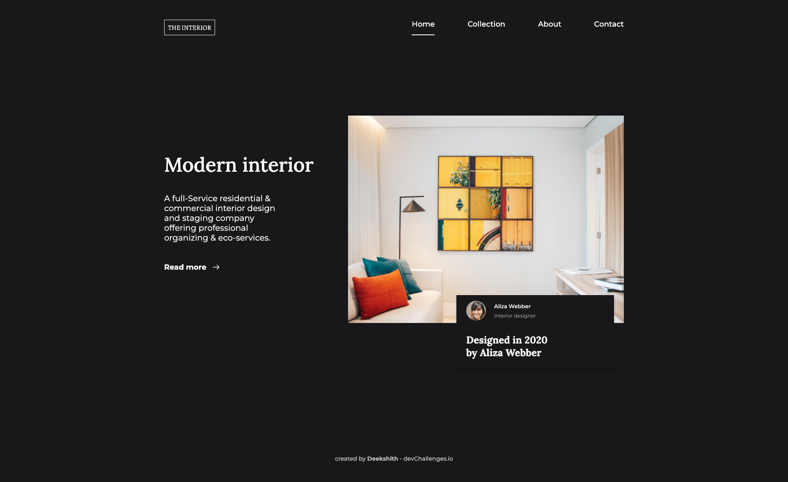

<!-- Please update value in the {}  -->

<h1 align="center">Landing Page</h1>

   Solution for a challenge from  <a href="http://devchallenges.io" target="_blank">Devchallenges.io</a>.

  <h3>
    <a href="https://github.com/Deekshithrathod/dc-rwd-3-landing-page">
      Demo
    </a>
     | 
    <a href="https://github.com/Deekshithrathod/dc-rwd-3-landing-page">
      Solution
    </a>
     | 
    <a href="https://devchallenges.io/challenges/Jymh2b2FyebRTUljkNcb">
      Challenge
    </a>
  </h3>

<!-- TABLE OF CONTENTS -->

## Table of Contents

- [Overview](#overview)
  - [Built With](#built-with)
- [Features](#features)
- [Contact](#contact)
- [Acknowledgements](#acknowledgements)

<!-- OVERVIEW -->

## Overview

|                    Desktop                     |                   Mobile                   |
| :--------------------------------------------: | :----------------------------------------: |
|  |  |

- Where can I see your demo? [here](https://devchallenges-rwd-3.onrender.com)
- What have you learned/improved? Responsive menu

### Built With

<!-- This section should list any major frameworks that you built your project using. Here are a few examples.-->

- Simple HTML, CSS & JS

## Features

<!-- List the features of your application or follow the template. Don't share the figma file here :) -->

This application/site was created as a submission to a [DevChallenges](https://devchallenges.io/challenges) challenge. The [challenge](https://devchallenges.io/challenges/Jymh2b2FyebRTUljkNcb) was to build an application to complete the given user stories.

|                  Home                   |                   Menu                   |
| :-------------------------------------: | :--------------------------------------: |
|  |  |

- Where can I see your demo? [here](https://devchallenges-rwd-3.onrender.com)
- What have you learned/improved? Responsive menu

## Acknowledgements

<!-- This section should list any articles or add-ons/plugins that helps you to complete the project. This is optional but it will help you in the future. For exmpale -->

- [Steps to replicate a design with only HTML and CSS](https://devchallenges-blogs.web.app/how-to-replicate-design/)

## Contact

- GitHub [@Deekshithrathod](https://github.com/Deekshithrathod)
- Twitter [@Deekshithrathod](https://twitter.com/Deekshithrathod)
